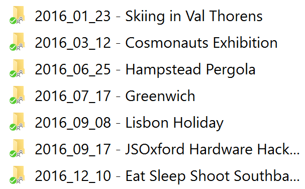
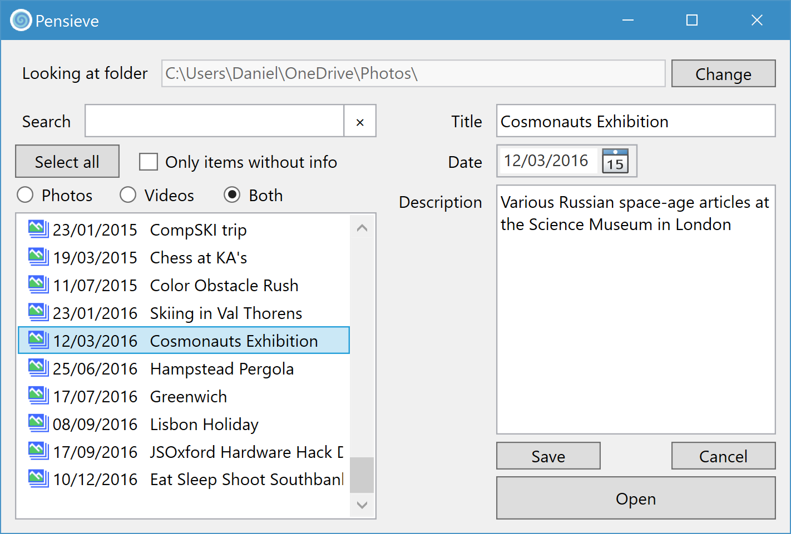
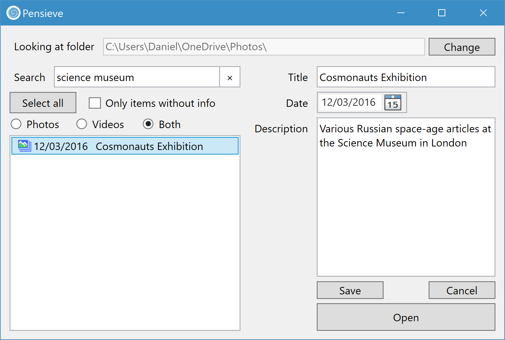

# Pensieve: Recall your memories.
>"One simply siphons the excess thoughts from one's mind, pours them into the basin, and examines them at one's leisure."
>
> \- Albus Dumbledore, Harry Potter and the Goblet of Fire

Pensieve is a Windows desktop application that helps you find collections of photos and videos.

**Pensieve is still in early development but you're welcome to try it out**

If you're like me, you've got thousands of photos that you've taken over the years, all sorted into folders. My folders are all named with the date in yyyy_MM_dd format, with a short title.

Windows makes these folders easy enough to find. For example I can just open the Start menu and type 'Lisbon' and my holiday folder will show up.

But what if I wanted to find folders containing photos from the Science Museum? I can't type 'science museum' and magically have the Cosmonauts Exhibition appear. Ideally I want to provide a short description for each folder: this will be much faster to do rather than tagging and describing each photo.

Pensieve allows you to describe and find photo albums named in this way. First, select a root folder that contains all your photos. Pensieve searches for any subfolders named in this way.

You can then select albums in turn and provide a description.

Once descriptions are saved, you can search your descriptions to filter your list of albums. Any albums containing the phrase 'science museum' in the description or title will show up in the results.

Double clicking an album currently opens the folder in Explorer.
